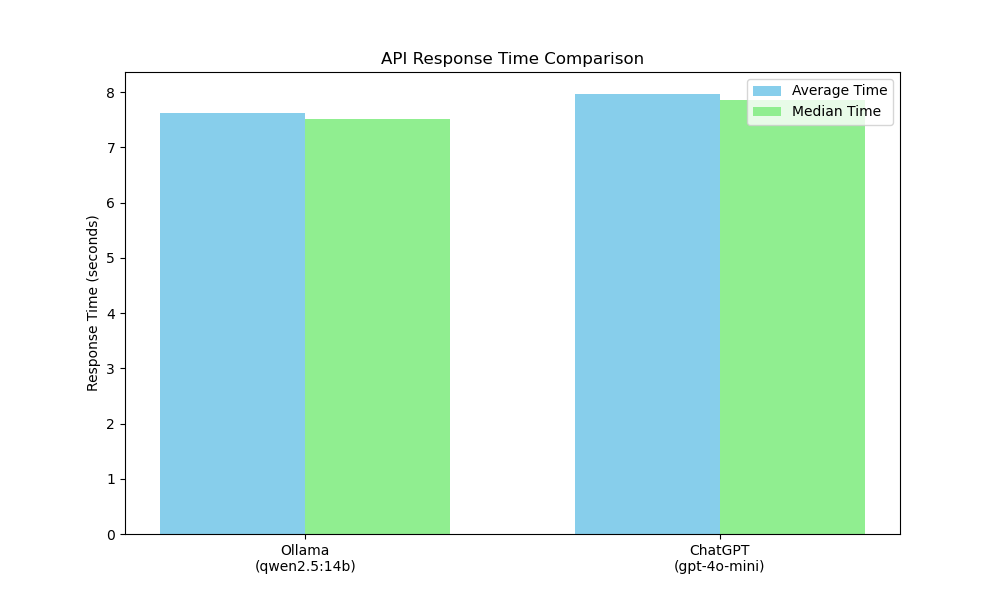

# LLM Response Time Evaluation

A Python tool for comparing response times between different LLM services, specifically Ollama and ChatGPT.

## Overview

This script allows you to benchmark and compare the response times of different LLM services. It currently supports:

- **Ollama**: Local LLM models running on your machine
- **ChatGPT**: OpenAI's API-based models

The tool runs each model multiple times with the same prompt, collects timing data, generates statistics, creates visualizations, and saves the results to a JSON file.

## Requirements

- Python 3.x
- Ollama running locally (default: http://localhost:11434)
- OpenAI API key
- Required Python packages:
  - requests
  - matplotlib
  - openai
  - statistics

## Command Line Arguments

| Argument | Description | Default |
|----------|-------------|---------|
| `--prompt` | The prompt to send to both APIs | "What equipment can help older adults stay safe and avoid falls during winter?." |
| `--ollama-model` | The Ollama model to use | "qwen2.5:14b" |
| `--ollama-url` | The base URL for Ollama API | "http://localhost:11434" |
| `--chatgpt-model` | The ChatGPT model to use | "gpt-4o-mini" |
| `--openai-api-key` | OpenAI API key | *Required* |
| `--runs` | Number of runs per model | 5 |
| `--output-file` | Output file for JSON results | Auto-generated filename with timestamp |
| `--plot-file` | Output file for comparison plot | "response_time_comparison.png" |

## Example Usage

```bash
python main.py --openai-api-key "your-api-key-here" --prompt "What are the best practices for Python error handling?" --runs 3
```

## Output

### Visualization

The script generates a bar chart comparing the average and median response times of each model:



### JSON Results

Results are saved to a JSON file with the following structure:

```json
{
  "test_date": "2025-04-03 15:55:47",
  "prompt": "What equipment can help older adults stay safe and avoid falls during winter?.",
  "Ollama": {
    "model": "qwen2.5:14b",
    "times": [
      7.15118932723999,
      8.29731011390686,
      7.513265371322632,
      7.7315661907196045,
      7.409899711608887
    ],
    "statistics": {
      "avg_time": 7.620646142959595,
      "median_time": 7.513265371322632,
      "min_time": 7.15118932723999,
      "max_time": 8.29731011390686
    }
  },
  "ChatGPT": {
    "model": "gpt-4o-mini",
    "times": [
      7.772520303726196,
      7.17126202583313,
      8.924518823623657,
      8.099108457565308,
      7.862271785736084
    ],
    "statistics": {
      "avg_time": 7.965936279296875,
      "median_time": 7.862271785736084,
      "min_time": 7.17126202583313,
      "max_time": 8.924518823623657
    }
  }
}
```

## How It Works

1. The script initializes LLM services based on your configuration
2. It runs each service multiple times with the same prompt
3. Response times are collected and statistics are calculated
4. A visualization is generated comparing the performance
5. All results are saved to a JSON file for further analysis

## Contributing

Feel free to fork this repository and submit pull requests to add support for additional LLM services or improve the existing functionality.
